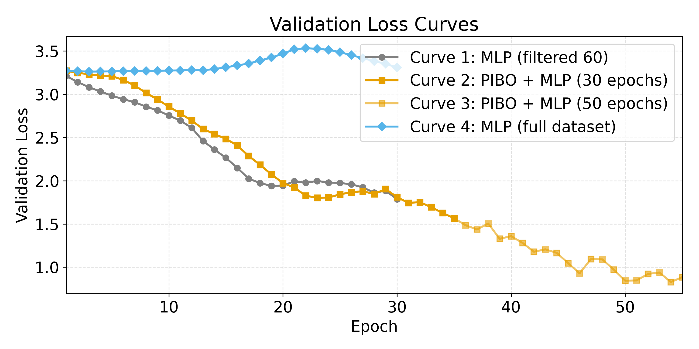
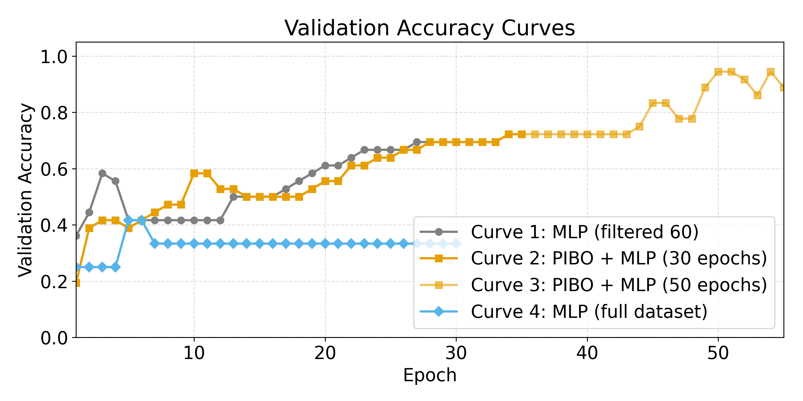
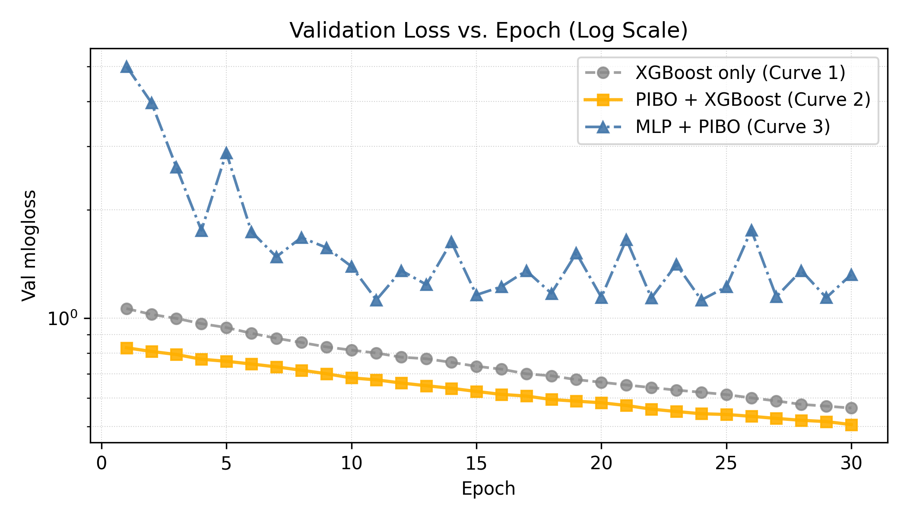
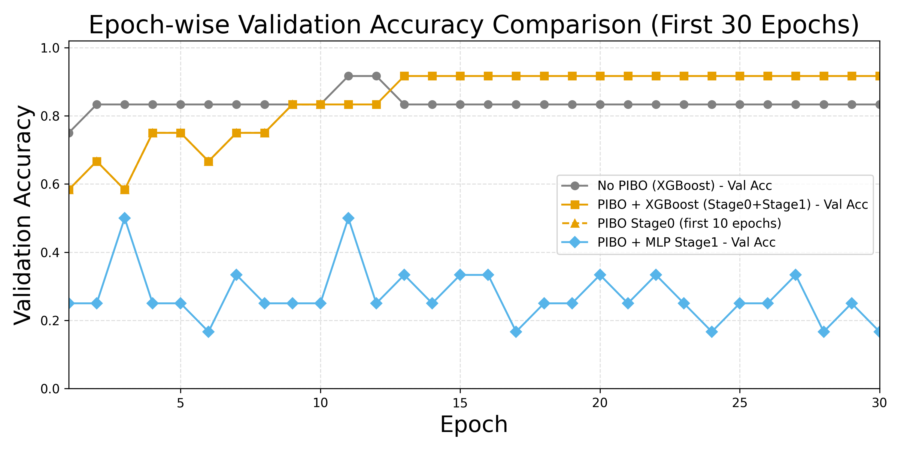

# Scientific Machine Learning for Joint Detector Selection

This repository collects the code, logs, and figures used in EN.560.652 Scientific Machine Learning for Modeling to study how physical priors and lightweight learners can select the best 3D detector per object class. The project covers two benchmarks:

- **KITTI case study:** a 5-layer PyTorch MLP predicts which of several LiDAR detectors (PartA2 vs. PointRCNN/TED) should be trusted for each object class (Car, Pedestrian, Cyclist) inside curated “cases”.
- **nuScenes case study:** an XGBoost pipeline, warmed up with physics-informed (PIBO) weights, ranks BEVDAL, BEVFusion, and TransFusion proposals per `sample_token`.

## Repository Layout

| Path | Description |
| ---- | ----------- |
| `HW3.ipynb` | Scratch notebook used to explore logs and summarize early experiments. |
| `kitti/` | Raw selections (`BEST_SELECTION_*.jsonl`), subset scripts, combo statistics, and curated case folders under `Dataset_Prepare/`. |
| `nuscenses/` | nuScenes CSVs/JSONs, processing helpers (e.g., `nuScenes_process.py`), and per-model top-k merges (`top_by_model/`). |
| `Tools_KITTI/` | PyTorch training/validation scripts, pretrained checkpoints (`case_mlp_*.pth`), logs, and plotting utilities + figures. |
| `Tools_nuscenes/` | PIBO/XGBoost trainers, validation helpers, CSV outputs, boosters (`xgb_*.bin`), and visualization scripts. |
| `Tools_*/*/draw_figure/` | Matplotlib helpers that regenerate the figures shown below. |

## Environment

```bash
conda create -n sci-ml python=3.10 -y
conda activate sci-ml
pip install torch torchvision torchaudio --index-url https://download.pytorch.org/whl/cu118  # set CUDA/cu11x as needed
pip install numpy pandas scikit-learn xgboost matplotlib seaborn tqdm
```

GPU training is supported but optional—set `DEVICE = "cpu"` inside the scripts if necessary.

## Data Preparation

### KITTI
1. Place all raw per-class selection dumps under `kitti/` (see `BEST_SELECTION_*.jsonl` for format).
2. Use `kitti/KITTI_sub_dataset.py` (or `KITTI_sub_dataset_file_2_combine.py`) to assemble the 60 curated cases stored under `kitti/Dataset_Prepare/selected_cases_60*`.
3. The `detailed_tpfp_*.jsonl` files retain per-difficulty breakdowns (d0–d2, multiple IoU thresholds), which power the MLP features.

### nuScenes
1. Aggregate model metadata with `nuscenses/nuScenes_process.py` or `top_by_model/merge.py` to obtain `top_by_model/merged_top_samples_top10det.csv`.
2. Additional diagnostics (`best_model_per_token.csv`, `top60*.csv`) can be regenerated from `merged_predictions.json` and `merged_predictions.csv`.
3. Stored CSVs already include PIBO-friendly fields (`num_detections`, `rank_in_model`, `best_nd_score`, etc.).

## Experiments

### KITTI 3-Way Case MLP (`Tools_KITTI/`)

- **Training:** `python Tools_KITTI/Sci_ML_kitti_train.py` trains a 5-layer MLP (15-d input → 3 heads) on `kitti/Dataset_Prepare/selected_cases_60`. Hyperparameters (`BATCH_SIZE`, `EPOCHS`, `LEARNING_RATE`, `HIDDEN_SIZES`) are defined up top.
- **Variants:** `Sci_ML_kitti_train_V2_*` add PIBO-inspired weighting or use the full dataset with per-box statistics.
- **Validation:** `python Tools_KITTI/Sci_ML_kitti_val.py` evaluates saved checkpoints (e.g., `case_mlp_3way_pibo_88_94.pth`) on the held-out split and logs per-head accuracy to `val.log`.
- **Visualization:** `Tools_KITTI/Sci_ML_KITTI_Draw.py` and its variants pull metrics from `Training_previous_log.log` and recreate the figures below.

### nuScenes PIBO + XGBoost (`Tools_nuscenes/`)

- **Two-stage training:** `Training_PIBO_XGBoost_v5.py` (and earlier revisions) first runs a 10-round PIBO warm-up using physical attributes (`best_nd_score`, `max_det_score`, `rank_in_model`), then fine-tunes for 40 rounds with uniform weights.
- **Alternatives:** `Training_PIBO.py` focuses on the warm-up only, while `Training_PIBO_XGBoost.py`–`v4.py` explore different feature sets or class subsets.
- **Validation:** `validation.py` reads the saved booster (e.g., `xgb_nuscenes_bestmodel_XGBoost_PIBO_9167.bin`) and exports per-token predictions to `validation_predictions.csv` along with accuracy curves.
- **Figure scripts:** `draw_figure/*.py` build the multi-metric plots shown in the next section.

## Key Files & Outputs

- `Tools_KITTI/case_mlp_3way_*.pth`: best-performing checkpoints (baseline, PIBO, and full-dataset variants).
- `Tools_KITTI/Training_previous_log.log` & `val.log`: contain per-epoch loss/accuracy summaries consumed by the plotting utilities.
- `Tools_nuscenes/xgb_nuscenes_*.bin`: serialized XGBoost boosters aligned with the CSV feature schema.
- `Tools_nuscenes/validation_predictions.csv` and `xgb_val_results_v2.csv`: evaluation dumps for downstream inspection.

## Result Highlights






- The KITTI MLP converges quickly and keeps validation accuracy above 0.88 on the PIBO-weighted model (`case_mlp_3way_pibo_88_94.pth`).
- nuScenes two-stage XGBoost reaches ~0.92 top-1 accuracy within 30 boosting rounds when the PIBO warm-up is enabled, outperforming single-stage baselines.
- Additional figure variants (`Tools_KITTI/kitti_val_loss_curves.png`, `Tools_nuscenes/draw_figure/val_loss_curves_first30.png`, etc.) cover alternative splits and ablations.

## Regenerating Figures

```bash
# KITTI metrics → figures
python Tools_KITTI/draw_figure/draw_figure.py \
    --train-log Tools_KITTI/Training_previous_log.log \
    --val-log Tools_KITTI/val.log \
    --output-dir Tools_KITTI

# nuScenes metrics → figures
python Tools_nuscenes/draw_figure/draw_figure.py \
    --log Tools_nuscenes/training_val.log \
    --output-dir Tools_nuscenes
```

Each script exposes CLI flags for alternative input files if you rerun experiments.

## Next Steps

- Extend the KITTI MLP to incorporate per-box geometry from `selected_cases_60_full_v2_all_boxes`.
- Explore additional physics-inspired weighting schemes for nuScenes (e.g., using IoU residuals).
- Package environment dependencies (e.g., via `requirements.txt`) to streamline reproducibility on new machines.
